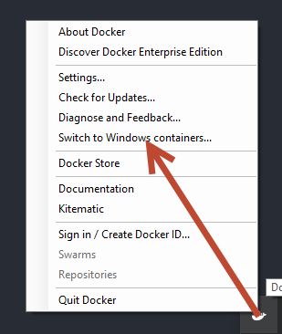

# Timebox team: Containers demo

## Setup

* Install Docker for Windows (https://docs.docker.com/docker-for-windows/install/)
  - Switch Docker to Windows Containers:

   

  - Docker images will be saved to your C:\ Drive by default, which you can override by updating the Deamon
   config file and specifying a value for `graph`.

   

   - It's probably also worth noting that Docker will use your Windows TEMP location for extracting downloaded
    images.

* Open Powershell and run `docker pull microsoft/mssql-server-windows`. This will download the latest
SQL Server windows container image. This isn't strictly necessary, but will save time when you first press f5
in VS.

* Open Visual Studio 2017 (or above) __as administrator__ and load the solution

* Press f5

## How the solution is organised

<excuse>
This is a very basic solution only designed to demonstrate the mechanics of using SQL Clone and ReadyRoll with
a containerised SQL Server(s).
</excuse>

The solution consists of:

* Web application (_WebApplication1_)
* WebApi (_WindowsContainers_)
* Two ReadyRoll projects (_StockDatabase_, _PriceDatabase_)

As defined in the `docker-compose.yml` file, when you hit f5, four containers will be launched. Two of which
are SQL Servers. Once built the page loaded will be http://{IPAddress-of-WebApplication1-service-container}/Home/Product

## Working with the Containers

You can see what containers are currently running using the powershell command `docker ps`. This will
give you the container Id which is useful if you want to interact with the conmtainer directly.

If you want to kill all running containers use `docker kill $(docker ps -q)` or to kill specific ones use the
container id e.g. `docker kill 123456`

To delete the containers use `docker rm $(docker ps -a -q)`

If you want to powershell into the container use `docker exec -it <containerId> powershell`

To connect to one of the SQL Servers, you can use SSMS with the container Id as the server name.
The sa password is `D0cker!a8s`

## 
